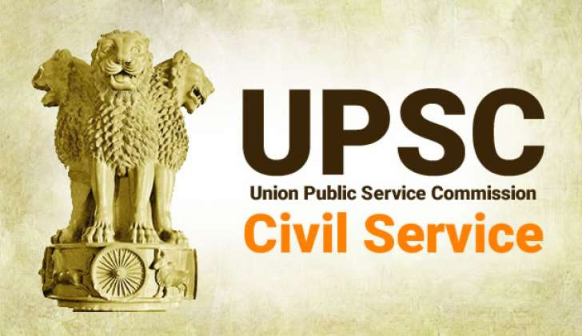

# UPSC Resources

---

## Table of Contents

### Political Science & International Relation

- [**PSIR Index Doc**](https://docs.google.com/document/d/1LqIcUt0nw9mdsQ4G5cRGtHLlKIYhq6lGu5WT1-MN8Ek/edit?tab=t.0)
- [**PSIR Paper 1A**](https://docs.google.com/document/d/1_JBRBNn_DLLGzvfjY7y9vnvZMAvGkQhDMvcZ7qvaLiw/edit?tab=t.0)
- [**PSIR Paper 1B**](https://docs.google.com/document/d/1pqjsqfu4IUT56KV_brkhZ2mFN0CRXP1ehktqw2dRcLM/edit?tab=t.0)
- [**PSIR Paper 2A**](https://docs.google.com/document/d/1CsCtYqmXkHhLDRl7Ed14ju2eCMucZl0TxL6-rri2DrY/edit?tab=t.0)
- [**PSIR Paper 2B**](https://docs.google.com/document/d/1qNaQe3RFEJ9J2qvaorr3XJVB0iaiW8FfW4N5LjIN_Vg/edit?tab=t.0)
- [**PSIR PYQ - My Notes**](https://lookerstudio.google.com/u/0/reporting/d9255db9-c378-4a62-aed2-d871acd362b9/page/IZ8xC)
- **Other Resources**
  - [**My Notes from PFI**]()
  - [**Politics for India**](https://politicsforindia.com/)
  - [**PSIR Analytica**](https://www.insightsonindia.com/psir-analytica/)

---

### General Studies

- [**Quick Access All Notes**](https://docs.google.com/document/d/1R2EGeZXJleMdYfMCcpE_Hs-xeuWt9gQJnP_JCkGwT08/edit?tab=t.0)
- [**Prelims Analysis**](https://docs.google.com/document/d/1_-Mk6DrbUBTuWuJMzIVmZaoRuGMpvL7MsfPWSo4s9tY/edit?tab=t.0#heading=h.2otldzxgq5ox)
- [**Search Doc based on Requirements**](https://docs.google.com/document/u/0/)
- [**History Notes**]()
- [**PYQ Prelims**](https://educationprovince.com/upsc-prelims-previous-year-questions-topic-wise/)
- [**PYQ Mains**](https://educationprovince.com/upsc-mains-topic-wise-questions/)
- **Other Resources**
  - [**Understand UPSC**](https://www.understandupsc.com/)
  - [**Politics for India**](https://politicsforindia.com/)
  - [**Dr. Shivin**](https://onedrive.live.com/?id=32B3065D74705B74%2115209&cid=32B3065D74705B74)

---